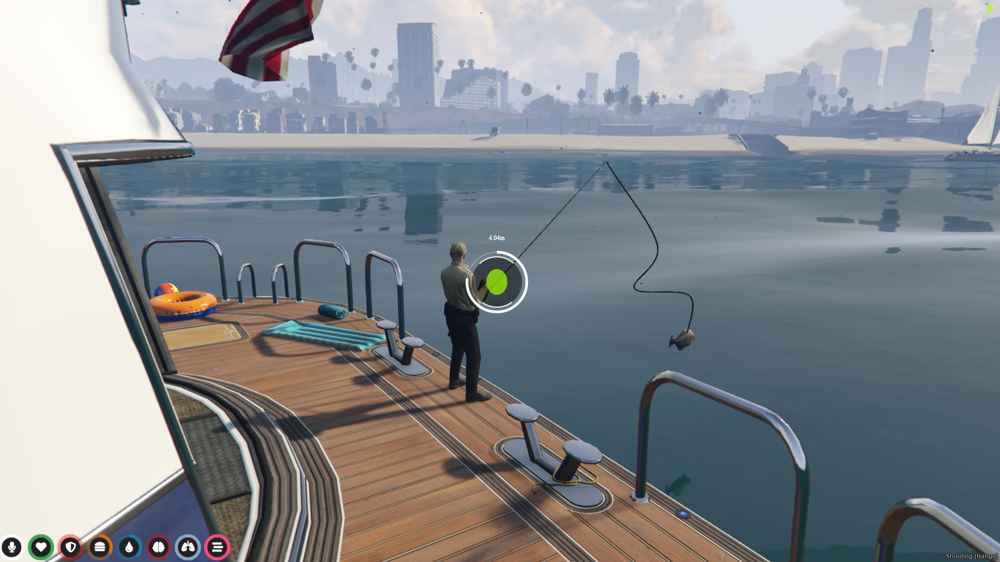
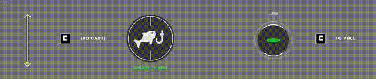
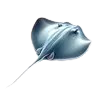

<div align="center">



[](https://github.com/brz-gta5/fivem-brz-fishing-ts/actions/workflows/brz-fishing-ci.yml) [](https://codeclimate.com/github/brz-gta5/fivem-brz-fishing-ts/maintainability) [](https://codeclimate.com/github/brz-gta5/fivem-brz-fishing-ts/test_coverage) [](https://discord.gg/BAZ5aCU)

### Highly customisable fishing script for FiveM servers

This script is 100% free, you can support my work by giving a star to this repository or becoming a sponsor.

[Become a sponsor 💜](
    https://github.com/sponsors/pedropapa
)
</div>

## Supported frameworks

- [x] qb-core, qb-inventory
- [x] Quasar Framework implementation for QBCore (qs-inventory)

Note: ESX or any other framework is not supported at the moment, feel free to contribute or open a feature request.

## ⚡️ Features

### Unique User Interface

Designed from scratch, inspired by fishing mechanics in games like New World and Sea of Thieves.



### Unique Fishing Mechanics

- Realistic rod with line that moves according to the fish
- Fish catching animation
- Water splash effects
- 2D ui positioning locked to fishe's world position
  


### 

### Highly customisable!

You can change pretty much any aspect of the script, from the fishing mechanics to the UI, everything is customisable.

The script is also 100% unit tested, so you can be sure that your changes won't break anything, it also makes the script easy read, understand and maintain by you or other contributors.

### Integration with other frameworks

The script is designed to be framework agnostic, but it has built-in support for qb-core and Quasar Framework (qs-inventory). Integrating with other frameworks is easy, given the script's modular architecture.

## Installing

Please read the [installation guide](./INSTALLING.md) for more information.

### Default fishing items

| Item name                  | Description                                        |
| :--------------------- | :------------------------------------------------- |
|  fishingrod1              | Rod object the player will be assigned with when start fishing.   |
|  commonbait                 | Consumable item automatically used when the casting minigame finishes.    |
| fish | Common fish, can be found at any fishing spot. |
| dolphin | Uncommon fish, can be found at the deep sea. |
| hammershark | Uncommon fish, can be found at the deep sea. |
| tigershark | Rare fish, can be found at the deep sea. |
| killerwhale | Epic fish, can be found at the deep sea in some seasons of the year. |
| humpback | Legendary fish, can be found at the deep sea in some seasons of the year. |
| stingray | Rare fish, can be found at the deep sea. |

## 👨‍💻 Contributing

1. Clone the repository into your local server.

```bash
cd <server_root_path>/txdata/resources
git submodule add https://github.com/brz-gta5/fivem-brz-fishing-ts.git brz-fishing
```

1. Install [NodeJS](https://nodejs.org/en/download/package-manager) and [nvm](https://github.com/nvm-sh/nvm).
   - Tip: You can quickly install nvm by running `npm install -g nvm`.
2. Install the correct Node version, project dependencies and test if tests and build are working:
```bash
cd brz-fishing
nvm install
nvm use
yarn
yarn test
yarn build
```
3. Work on your changes and test them with `yarn test`
4. Make sure the build is successful with `yarn build`
5. Create a pull request

Note: Contributions not covered by tests will not be accepted.